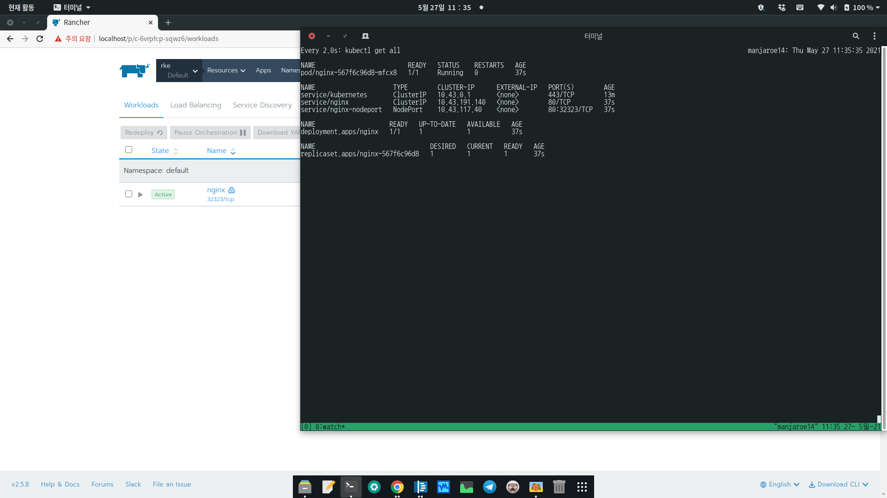

# Rancher Kubernetes

## start rancher docker 

```
sudo docker run --privileged -d --restart=unless-stopped -p 80:80 -p 443:443 rancher/rancher
```


## server 

* rkemaster : 192.168.33.20
* rkeworker1 : 192.168.33.21
* rkeworker2 :192.168.33.22

## install docker 
```
{
yum install -y yum-utils device-mapper-persistent-data lvm2
yum-config-manager --add-repo https://download.docker.com/linux/centos/docker-ce.repo
yum install -y docker-ce-19.03.12 
systemctl enable --now docker
}
```

## Rancher에서 설정값 생성후 각 터미널에서 실행 
* master 
```
sudo docker run -d --privileged --restart=unless-stopped --net=host -v /etc/kubernetes:/etc/kubernetes -v /var/run:/var/run  rancher/ranc
her-agent:v2.5.8 --server https://192.168.0.130 --token hlcn45c7rjdktpnm4m4q6wmzfrsrxp9v744q6jt86njc7z4gxskksj --ca-checksum 5d4d80f0f8fa7f203d87d4119ff17ae7
0c6904e06f5c6536f2823750f634afef --node-name rkemaster --address 192.168.33.20 --internal-address 192.168.33.20 --etcd --controlplane --worker               
```

* worker1
```
sudo docker run -d --privileged --restart=unless-stopped --net=host -v /etc/kubernetes:/etc/kubernetes -v /var/run:/var/run  rancher/rancher-agent:v2.5.8 --server https://192.168.0.130 --token hlcn45c7rjdktpnm4m4q6wmzfrsrxp9v744q6jt86njc7z4gxskksj --ca-checksum 5d4d80f0f8fa7f203d87d4119ff17ae70c6904e06f5c6536f2823750f634afef --node-name rkeworker1 --address 192.168.33.21 --internal-address 192.168.33.21 --worker
```

*worker22 
```
sudo docker run -d --privileged --restart=unless-stopped --net=host -v /etc/kubernetes:/etc/kubernetes -v /var/run:/var/run  rancher/rancher-agent:v2.5.8 --server https://192.168.0.130 --token hlcn45c7rjdktpnm4m4q6wmzfrsrxp9v744q6jt86njc7z4gxskksj --ca-checksum 5d4d80f0f8fa7f203d87d4119ff17ae70c6904e06f5c6536f2823750f634afef --node-name rkeworker2 --address 192.168.33.22 --internal-address 192.168.33.22 --worker
```


## Screen Shots


